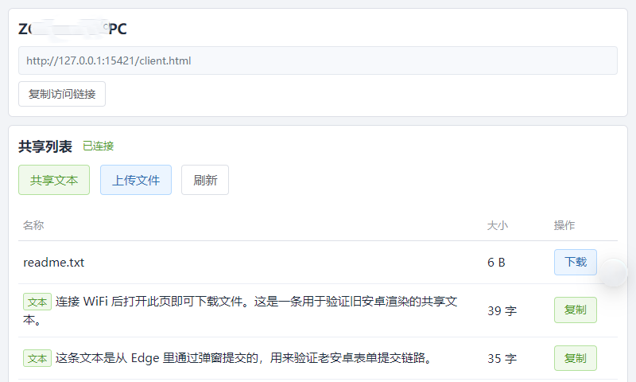
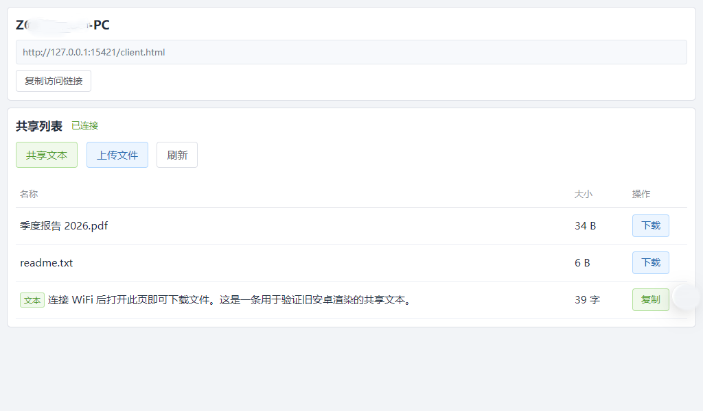
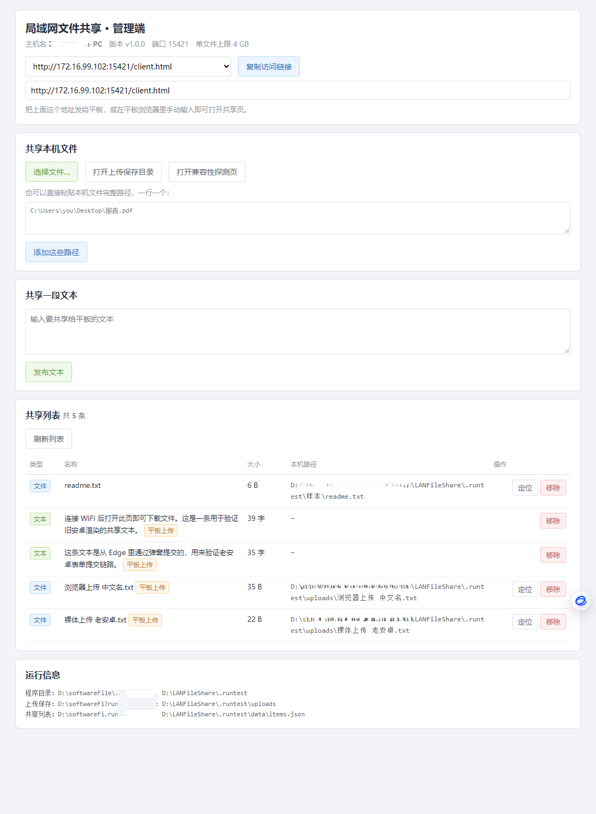

# LANFileShare · 局域网文件共享（老安卓兼容版）

一个给**旧版安卓平板 / 老手机浏览器**用的极简局域网文件共享工具。

Windows 端双击一个 `.exe` 就跑起来，平板浏览器打开一个地址就能**看列表、下文件、传文件、共享文本**。
单个可执行文件，纯 Go 标准库，**零第三方依赖**。

仓库地址：<https://github.com/KevinLi-167/lan-file-share> · 当前版本 **v1.0.1**

> **关于本项目**
> 前端页面（功能划分、页面布局、交互方式）参考并致敬开源项目
> [**tri5m/file-share**](https://github.com/tri5m/file-share)（MIT License，Copyright © 2026 Trifolium Wang）。
> 差异在于：本项目**不是**它的分支，也没有沿用它的 Rust + Tauri 架构与前端代码栈 ——
> 服务端是全新的 Go 单文件实现，前端是按老 WebKit 内核能力**重写的纯 ES5 页面**。
> 目标是同一个：局域网里临时传文件、传文本。详见文末「来源与致谢」。

代码规模（含逐段中文注释）：

| 部分 | 文件 | 行数 |
|---|---|---|
| Go 服务端 | `main.go` / `handlers.go` / `store.go` / `pick_windows.go` / `pick_other.go` | ~1,650 |
| 前端页面 | `web/client.html` / `admin.html` / `probe.html` | ~1,290 |
| 自动校验 | `scripts/check-es5.mjs` / `check-render.mjs` | ~490 |
| **合计** | | **~3,400** |

---

## 它解决什么问题

参考项目 `tri5m/file-share` 是 Tauri 桌面应用，前端使用了 `const/let`、箭头函数、`async/await`、
`fetch`、`<dialog>`、CSS 变量、`grid`、`flex gap` 等特性。这些在 **Android 4.3 及更老的老 WebKit 内核**
上全部不可用，结果是：页面加载不出来、文件列表空白、UI 错乱、点了下载没反应。

本项目只保留「局域网传文件」这个核心功能，前端全部重写为 **纯 ES5**，从根上避开这些坑。

---

## 目标环境与兼容性红线

- **服务端**：Windows 10/11（Go 编译出的原生 exe）
- **客户端**：Android 4.3 及更老的老 WebKit 浏览器 / WebView

改动 `web/` 下的页面时，以下纪律**不能破**：

| 红线 | 替代方案 |
|---|---|
| 不用 `const` / `let` / 箭头函数 / 模板字符串 | 全部 `var` + `function` |
| 不用 `fetch` / `Promise` / `async` `await` | `XMLHttpRequest` + 回调 |
| 不用 `EventSource`(SSE) / WebSocket | `setInterval` 轮询，3 秒一次 |
| 不用 `<dialog>` | `div` 遮罩 + `display` 切换 |
| 不用 CSS 变量 / `grid` / `flex gap` / `clamp()` / `dvh` | `table` + `inline-block` 布局，色值写死 |
| 不用 `Blob` / `URL.createObjectURL` / `FileReader` | 下载靠 `<a href>` + 服务端 `Content-Disposition` |
| 不用 `Element.closest` / `.includes()` / `.startsWith()` | `indexOf()` / 手写遍历 |
| 不依赖 `input[type=file][multiple]` | 单选，可重复选择多个文件 |

**这些红线由脚本自动校验**，改完前端跑一次：

```bash
npm install          # 只装 acorn 与 jsdom，用于静态校验，与 Go 主程序无关
npm run check        # ES5 语法 + ES6 API + 老 WebKit 不支持的 CSS
npm run check:render # 用 jsdom 真实跑一遍页面，验证列表渲染与边界用例
```

`check-es5.mjs` 会做三件事：
1. 用 acorn 按 **ECMAScript 5** 解析页面里每一段内联脚本，出现 ES6 语法直接报错
2. 扫描 ES6+ 才有的 API（`fetch`、`Object.assign`、`.includes(` …）
3. 扫描老 WebKit 不支持的 CSS 特性（`var(--`、`display: grid`、`backdrop-filter` …）

`check-render.mjs` 用 jsdom 把页面真的跑起来，喂进含中文名、失效文件、4 GB 文件、
带引号与 HTML 标签的文件名等构造数据，断言渲染结果正确、没有脚本异常。

---

## 快速开始

### 1. 编译

从源码构建（需要 Go 1.21+）：

```cmd
git clone https://github.com/KevinLi-167/lan-file-share.git
cd lan-file-share
build.cmd
```

产物在 `dist\LANFileShare_v1.0.1.exe`（约 6 MB，静态链接，不依赖任何运行库）。

也可以直接 `go build -trimpath -ldflags "-s -w" -o dist\LANFileShare.exe .`，
或 `go install github.com/KevinLi-167/lan-file-share@latest` 装到 `GOPATH\bin`。

### 2. 启动

双击 exe。程序会：

1. 在 **5421** 端口启动服务（被占用则自动往后找 50 个端口）
2. 自动用系统默认浏览器打开管理页 `http://127.0.0.1:<端口>/admin`
3. 控制台打印平板要访问的地址

```
========================================
  局域网文件共享  v1.0.1
========================================
  本机主机名 : YOUR-PC
  监听端口   : 5421
  上传保存到 : <exe目录>\uploads
  共享列表   : <exe目录>\data\items.json
  --------------------------------------
  管理页（本机）: http://127.0.0.1:5421/admin
  客户端访问地址（发给平板）:
    http://192.168.1.23:5421/client.html
  --------------------------------------
```

### 3. 在平板上打开

建议**第一步先打开探测页**：

```
http://<你的局域网IP>:5421/probe.html
```

它会告诉你这台平板支持哪些能力，并且：
- **上传测试**：选一个文件，页面会显示服务端实际收到的文件名，用来确认中文文件名没被搞坏
- **下载测试**：下载一个中文名 `.txt`，确认文件名显示正常
- **扩展名测试**：下载一个 `.apk`，确认扩展名没被浏览器改成 `.bin`

你也可以直接在平板地址栏手输探针路径来试任意扩展名（不占用真实文件）：

```
http://<你的局域网IP>:5421/api/probe/download/测试.apk
http://<你的局域网IP>:5421/api/probe/download/测试.mp4
```

确认没问题后再打开 `/client.html` 正常使用。

> 探测页读的是**当前浏览器的真实能力**。在电脑 Chrome/Edge 里打开只会得到「全支持」，
> 只有在真平板的浏览器 / WebView 上打开才有诊断意义。

---

## 界面

**平板客户端**（截图取自 800×480 与 1024×600，右侧是真实浏览器渲染结果）：





**Windows 管理页**（本机浏览器打开）：



---

## 命令行参数

| 参数 | 默认值 | 说明 |
|---|---|---|
| `-port` | `5421` | 监听端口，被占用时自动往后试 50 个 |
| `-max-upload-gb` | `4` | 单个文件上传大小上限（GB） |
| `-upload-dir` | `<exe目录>\uploads` | 客户端上传文件的保存目录 |
| `-no-browser` | `false` | 启动后不自动打开管理页 |

---

## 功能

### 管理端（Windows 本机浏览器打开）

- **选择文件…** —— 调起 Windows 原生多选文件对话框
- **粘贴路径添加** —— 一行一个路径，适合脚本批量
- **共享文本** —— 发一段文本给所有客户端
- **列表管理** —— 定位（在资源管理器里选中）、移除（只取消共享，**不删磁盘文件**）
- 多个网卡时下拉切换访问地址、一键复制链接
- 失效文件（原文件被移走/删除）会灰显并标注，定位按钮禁用

### 客户端（平板）

- 共享列表，3 秒自动刷新
- 下载文件（支持 `Range` 断点续传）
- 上传文件到服务端 `uploads` 目录，重名自动加 ` (1)` ` (2)`
- 共享文本、复制文本内容
- 复制访问链接

---

## 安全边界

这是一个**面向可信局域网**的工具，请只在自己家里或内网的网络里使用。

- 管理页与管理接口**只允许回环地址调用**，局域网里其他设备访问会拿到 403
- 管理接口还要求携带页面注入的随机令牌（`X-FS-Token`），防止本机浏览器被跨站脚本伪造请求
- 客户端接口（列表 / 上传 / 下载 / 文本）在局域网内**不做鉴权**，这是有意为之
- 服务端**不提供** HTTPS、登录、病毒扫描、公网暴露能力

---

## 目录结构

```
LANFileShare/
├── main.go              程序入口、路由、网卡地址枚举、浏览器唤起
├── handlers.go          全部 HTTP 接口
├── store.go             共享列表内存模型 + JSON 持久化 + 文件名清洗
├── pick_windows.go      Win32 原生文件选择对话框（syscall 调用 comdlg32）
├── pick_other.go        非 Windows 平台的空实现，仅为编译通过
├── web/
│   ├── client.html      平板上的客户端页（纯 ES5，内联 CSS/JS）
│   ├── admin.html       Windows 本机管理页
│   └── probe.html       兼容性探测页
├── scripts/
│   ├── check-es5.mjs    老安卓兼容性自动校验（语法 + API + CSS）
│   └── check-render.mjs 离线渲染自检（jsdom 跑真实页面 DOM）
├── docs/images/         README 用的界面截图
├── build.cmd            编译脚本
├── LICENSE              本项目 MIT 许可
├── THIRD_PARTY_NOTICES.md  参考项目的 MIT 原始声明
└── dist/                编译产物
```

运行时会在 exe 同级创建：

- `uploads/` —— 客户端上传的文件
- `data/items.json` —— 共享列表（持久化，重启后还在）

---

## HTTP 接口一览

| 方法 | 路径 | 访问范围 | 说明 |
|---|---|---|---|
| GET | `/`、`/client.html` | 局域网 | 客户端页 |
| GET | `/probe.html` | 局域网 | 兼容性探测页 |
| GET | `/api/items` | 局域网 | 共享列表（不含本机磁盘路径） |
| GET | `/api/info` | 局域网 | 主机名、版本 |
| POST | `/api/text` | 局域网 | 发布文本 |
| POST | `/api/upload` | 局域网 | 上传文件（multipart 或裸 body） |
| GET | `/api/download/{id}/{文件名}` | 局域网 | 下载，支持 `Range`。末尾文件名是给浏览器看的，服务端只取 `{id}`；**不带文件名也能用** |
| GET | `/api/probe/download/{文件名}` | 局域网 | 下载探针，返回一个小文件，用来在真机上验证文件名与扩展名 |
| GET | `/admin` | 仅本机 | 管理页 |
| GET | `/api/admin/info` | 仅本机 + 令牌 | 服务信息 + 完整共享列表 |
| POST | `/api/admin/pick` | 仅本机 + 令牌 | 调起原生文件对话框 |
| POST | `/api/admin/files` | 仅本机 + 令牌 | 登记本机文件路径 |
| POST | `/api/admin/text` | 仅本机 + 令牌 | 发布文本 |
| POST | `/api/admin/remove` | 仅本机 + 令牌 | 移除共享条目 |
| POST | `/api/admin/reveal` | 仅本机 + 令牌 | 在资源管理器中定位 |

---

## 已知取舍

- **上传一次只能选一个文件**。老安卓对 `input[multiple]` 支持不可靠，为保证能选到文件，宁可不加 `multiple`。
  上传弹窗不会自动关闭，可以连续选多次。
- **列表最多延迟 3 秒刷新**。老安卓的 SSE 支持不可靠，用轮询换稳定。
- **没有二维码**。旧设备渲染二维码风险高，客户端只显示可复制的链接文本。
- 上传进度只给「正在上传…」文字状态，不给百分比（老安卓拿不到稳定网速）。

---

## 下载文件名与扩展名为什么这么麻烦

安卓内置浏览器对「下载后叫什么名字」的处理很不统一，本项目为此做了三层兜底，
三层都指向同一个结果，所以哪一层被用上都对：

| 层 | 服务端做了什么 | 谁会用到 |
|---|---|---|
| 1 | `Content-Disposition` 同时给 ASCII 回退名和 RFC 5987 编码名 | 认标准的浏览器（PC 端、较新安卓） |
| 2 | **下载 URL 末尾拼上真实文件名**（`/api/download/{id}/报告.pdf`） | 不认 `Content-Disposition`、退回用 URL 末段当名字的浏览器 |
| 3 | `Content-Type` 按真实扩展名给（`.apk` → `application/vnd.android.package-archive`） | 拿 MIME 反推扩展名的安卓下载器 |

第 3 层是最容易被忽略的一环：以前服务端一律返回 `application/octet-stream`，
安卓的下载器反推不出扩展名，就统一存成 **`.bin`** —— 用户实测下载 APK 变成 `.bin`
就是踩在这里。现在 `mimeByExt()` 里有一张显式表（约 40 个常见扩展名），
取值刻意选用**安卓 `MimeTypeMap` 认识的类型名**，并且一律不带 `; charset=` 参数
（带参数的值在那张查表里匹配不上，会退回 `.bin`）。

`X-Content-Type-Options: nosniff` 也一并加上了，避免浏览器在拿到真实 MIME 后去嗅探内容。

---

## 更新记录

### v1.0.1

真机（Android 6.0.1 / Chromium 37 平板）反馈「下载下来的文件扩展名全变成 `.bin`」后修复：

- 下载 URL 末尾拼上真实文件名，服务端仍只取 `{id}`（不带文件名的旧 URL 仍可用）
- `Content-Type` 改为按真实扩展名给出（[详见下方说明](#下载文件名与扩展名为什么这么麻烦)）
- 新增 `X-Content-Type-Options: nosniff`
- 探针页新增「扩展名测试」：可直接手输 `/api/probe/download/测试.apk` 在真机上验证
- 新增 `/favicon.ico` 返回 204，消掉浏览器控制台里的 404 噪音

### v1.0.0

首个版本：Go 单文件 exe + 三个纯 ES5 页面，局域网列表 / 上传 / 下载 / 共享文本。

---

## 来源与致谢

### 参考项目

[**tri5m/file-share**](https://github.com/tri5m/file-share) — *FileShare：面向局域网的轻量文件与文本共享工具*
（MIT License，Copyright © 2026 Trifolium Wang &lt;trifolium.wang@gmail.com&gt;）

对本项目的贡献主要体现在**产品层面**：

- 整体功能划分：桌面端登记本机文件、客户端上传/下载/共享文本
- 页面布局与交互：共享列表表格、管理端地址下拉、上传即走的操作节奏
- 「共享本机文件而不复制文件内容」这一核心语义
- 探测页要验证的中文文件名编码问题，也是从该项目的前端行为里暴露出来的

### 本项目的独立实现

| 维度 | 参考项目 | 本项目 |
|---|---|---|
| 服务端 | Rust + Tauri（约 1,400 行 `server.rs` + 原生窗口/托盘/自动更新） | Go 标准库单文件 exe（约 1,550 行，含注释） |
| 客户端 | 现代 JS（5 个模块、100 KB+），依赖 `fetch`/SSE/CSS 变量/`grid` | 单文件内联 ES5（`var` + `XMLHttpRequest` + `table` 布局） |
| 管理端 | Tauri 原生窗口 | 本机浏览器打开的内嵌网页 |
| 实时同步 | SSE | 3 秒轮询 |
| 支持平台 | Windows / macOS | Windows |

本项目**未复制**参考项目的源代码。

### 与参考项目的行为差异

- 无系统托盘、无自动更新、无多语言切换、无二维码（旧设备渲染风险高）
- 无下载速率实时显示；上传只给文字状态，不给百分比
- 上传一次只能选一个文件（老安卓 `input[multiple]` 不可靠）

---

## 许可

本项目采用 **MIT License**。

由于前端页面在功能划分、页面布局与交互方式上参考了 MIT 许可的
[tri5m/file-share](https://github.com/tri5m/file-share)，其原始版权声明已完整保留在
[`THIRD_PARTY_NOTICES.md`](THIRD_PARTY_NOTICES.md) 中；再分发本项目时请一并保留该文件。
